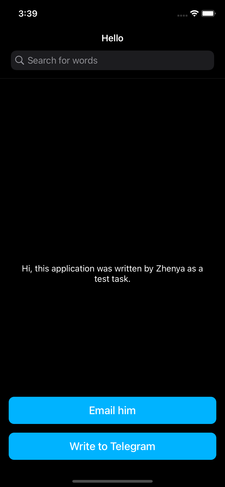
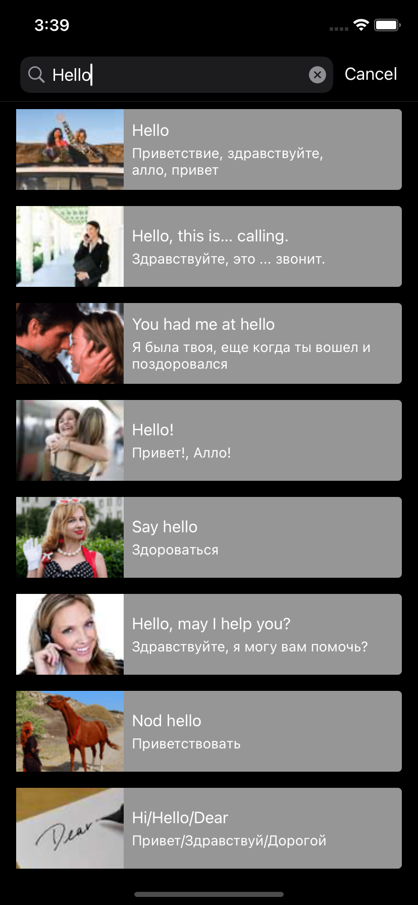
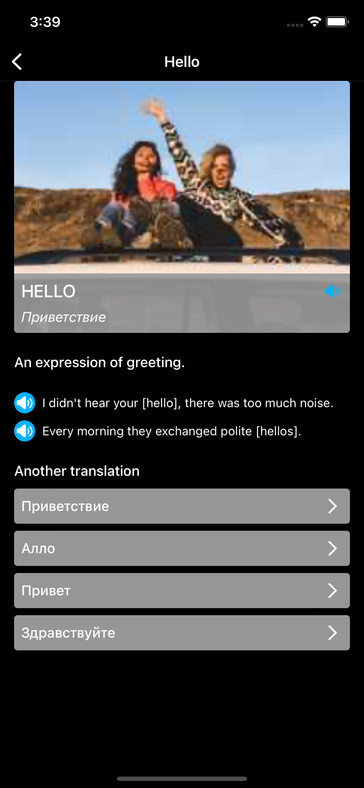

## DictionaryApp 
This is a simple application built using the [MVP](https://ru.wikipedia.org/wiki/Model-View-Presenter) + Coordinator + Router design pattern.
Application was written as a [test task](Docs/Task.md) from the Skyeng company.

[](https://github.com/muzle/DictionaryApp/blob/master/LICENSE)
[](https://codebeat.co/projects/github-com-muzle-dictionaryapp-master)

<table>
<tr>
    <th rowspan="9"></th>
    <th rowspan="9"></th>
    <th rowspan="9"></th>
  </tr>
</table>

## Instalation
1. The project uses the [Cocoapods](https://cocoapods.org) dependency manager, so the first step is to install it. The installation process is described in the official documentation.
2. After installing the [Cocoapods](https://cocoapods.org), run the following set of commands in a terminal:
```shell
git clone https://github.com/muzle/DictionaryApp.git
cd DictionaryApp
pod install
open DictionaryApp.xcworkspace
```

## Project dependencies
1. [SwiftLint](https://github.com/realm/SwiftLint) - is a tool to enforce Swift style and conventions, loosely based on the now archived [GitHub Swift Style Guide](https://github.com/github/swift-style-guide). SwiftLint enforces the style guide rules that are generally accepted by the Swift community. These rules are well described in popular style guides like [Ray Wenderlich's Swift Style Guide](https://github.com/raywenderlich/swift-style-guide).
2. [Sourcery](https://github.com/krzysztofzablocki/Sourcery) - is a code generator for Swift language, built on top of Apple's own SwiftSyntax. It extends the language abstractions to allow you to generate boilerplate code automatically.
   - I use this utility to provide an easy way to change the properties of a structure.
   - Automatic generation of coordinator factory.
   - To generate interfaces for dependency injection.
3. [SwiftGen](https://github.com/SwiftGen/SwiftGen) - is a tool to automatically generate Swift code for resources of your projects (like images, localised strings, etc), to make them type-safe to use.
    - Used for Assets
4. [SDWebImage](https://github.com/SDWebImage/SDWebImage) - this library provides an async image downloader with cache support.
5. [GoogleSheetLocalizationExport](https://github.com/muzle/GoogleSheetLocalizationExport) - tool for converting google spreadsheet to a localization file.
6. [Generamba](https://github.com/strongself/Generamba) - is a code generator made for working with Xcode. Primarily it is designed to generate VIPER modules but it is quite easy to customize it for generation of any other classes (both in Objective-C and Swift).
    - Used to quickly generate MVP modules.

## Setup [Generamba](https://github.com/strongself/Generamba)
1. Instalation
```shell
gem install generamba
```
2. Generate a scene and see how all this magic works together :-)
```shell
generamba gen Test scene
```

## Authors
Eugene Rudakov - [linkedin](https://www.linkedin.com/in/voragomod/)